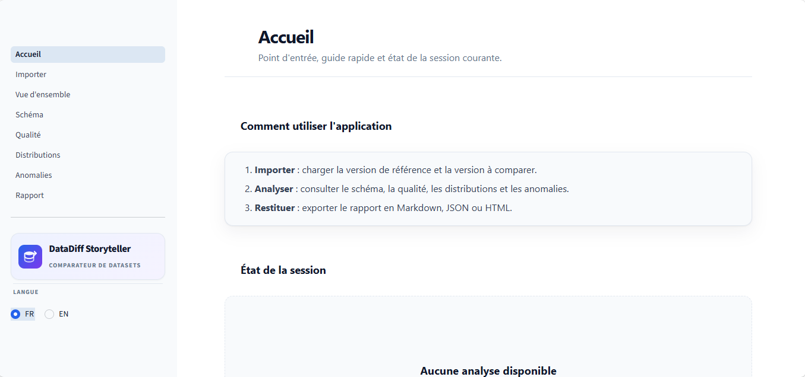

# 📁 DataDiff Storyteller

Version anglaise : [README.md](README.md)

Comparer deux versions d’un dataset et expliquer ce qui a changé sous forme de récit clair, structuré et exploitable par des métiers. L’outil ne se limite pas à un diff technique : il produit des findings structurés, une priorisation par sévérité, des diagnostics visuels et un rapport exportable.

Table des matières

- [Objectif de l’application](#objectif-de-lapplication)
- [Ce que l’outil analyse](#ce-que-loutil-analyse)
- [Trois modes de lecture](#trois-modes-de-lecture)
- [Données d’entrée](#données-dentrée)
- [Principes méthodologiques](#principes-méthodologiques)
- [Limitations assumées](#limitations-assumées)
- [Installation locale](#installation-locale)
- [Structure du projet](#structure-du-projet)
- [Auteur](#auteur)
- [Licence](#licence)

## Objectif de l’application

DataDiff Storyteller s’adresse aux équipes data qui reçoivent deux versions d’un même extract et qui doivent comprendre rapidement ce qui a changé, ce qui est risqué, et ce qu’il faut investiguer en priorité.

Cas d’usage typiques :

- comparer un fichier clients d’une année sur l’autre ;
- valider un export avant chargement dans un data warehouse ;
- passer en revue une migration entre deux versions de pipeline ;
- détecter une dégradation de qualité après un changement amont ;
- produire un rapport de changement lisible pour des métiers.

L’application ne répond pas seulement à « qu’est-ce qui est différent ? ». Elle répond à « que signifie cette différence ? ».

Exemple du style de sortie recherché :

    La colonne phone_number est devenue moins fiable : les valeurs manquantes passent de 12% à 30%.
    La colonne age contient désormais des valeurs supérieures à 120, probablement dues à des erreurs de saisie ou d’encodage.
    La distribution de subscription_tier introduit une nouvelle catégorie premium représentant 6% des clients.

## Ce que l’outil analyse

| Dimension | Ce qui est détecté |
| --- | --- |
| Schéma | Colonnes ajoutées, supprimées, possiblement renommées, types modifiés |
| Volume | Évolution du nombre de lignes, variation absolue et relative |
| Valeurs manquantes | Hausse ou baisse du taux de nullités par colonne |
| Distributions | Déplacement numérique via PSI et statistiques descriptives, changements catégoriels, catégories nouvelles ou disparues |
| Outliers | Nouvelles valeurs extrêmes par rapport aux bornes de la version de référence |
| Doublons | Doublons de lignes complètes et doublons sur colonnes candidates clés |
| Qualité | Colonnes devenues entièrement nulles, constantes, ou perdant fortement en cardinalité |
| Règles métier | Règles simples documentées sur âge, format email et montants négatifs lorsque les noms de colonnes correspondent à des mots-clés connus |

Chaque changement détecté est stocké sous forme de finding structuré contenant :

- un identifiant stable ;
- une catégorie ;
- un niveau de sévérité ;
- un titre ;
- une phrase narrative ;
- les colonnes concernées ;
- des métriques techniques ;
- une recommandation optionnelle ;
- des exemples de preuves optionnels.

## Trois modes de lecture

### Vue d’ensemble

La page Vue d’ensemble fournit le résumé exécutif :

- score de santé ;
- nombre de findings critiques, élevés et moyens ;
- évolution du volume de lignes ;
- évolution du nombre de colonnes ;
- comparaison des taux de valeurs manquantes ;
- principaux findings priorisés.

Ce mode est pensé pour le triage rapide.

### Pages de diagnostic

Les pages de diagnostic découpent l’analyse en vues ciblées :

- Schéma : correspondances de colonnes, ajouts, suppressions, renommages, changements de type ;
- Qualité : valeurs manquantes, doublons, colonnes entièrement nulles, colonnes constantes ;
- Distributions : comparaisons numériques et catégorielles avec graphiques Plotly ;
- Anomalies : outliers et violations de règles métier avec valeurs exemples.

Ce mode est destiné aux data engineers et analystes qui doivent investiguer les causes racines.

### Export du rapport

La page Rapport génère un résumé narratif et exporte l’analyse complète en trois formats :

- Markdown pour la documentation et les pull requests ;
- JSON pour l’automatisation et l’intégration CI/CD ;
- HTML pour le partage métier.

Ce mode est destiné à la restitution formelle.

## Données d’entrée

Le MVP accepte des fichiers texte délimités, principalement CSV.

Options disponibles sur la page d’import :

- détection automatique ou manuelle du séparateur ;
- virgule, point-virgule, tabulation, tube ;
- détection automatique ou choix manuel de l’encodage ;
- UTF-8, UTF-8 avec BOM, Latin-1, CP1252 ;
- limite de lignes pour protéger la mémoire.

Traitement des données dans le MVP :

- les fichiers importés sont parsés en mémoire applicative ;
- les résultats d’analyse sont stockés dans le session state Streamlit ;
- aucun stockage permanent en base n’est implémenté ;
- aucun appel LLM externe n’est requis pour le moteur de narration déterministe.

## Principes méthodologiques

L’application suit des règles de traçabilité strictes :

- les faits numériques sont calculés d’abord ;
- les phrases narratives sont générées à partir de findings structurés ;
- aucun chiffre n’est inventé par la couche de reporting ;
- les valeurs manquantes ne sont pas imputées ;
- chaque signal mentionne la colonne concernée et la métrique déclenchante ;
- chaque recommandation est liée à un changement détecté ;
- les contrôles statistiques sont génériques et ne dépendent pas d’un dataset de démonstration ;
- les contrôles de règles métier sont documentés et actuellement basés sur des mots-clés.

## Limitations assumées

Ces limitations sont assumées dans le MVP actuel :

- le format d’entrée public est CSV ;
- Parquet, tables SQL et intégration dbt sont des éléments de feuille de route ;
- les règles métier reposent actuellement sur des mots-clés dans les noms de colonnes tels que age, email, amount, value, price, revenue, montant ou lifetime ;
- la détection de renommage est heuristique et expose un score de confiance ;
- les fichiers très volumineux peuvent dépasser les limites mémoire même avec des options d’échantillonnage ;
- le profilage DuckDB est disponible en mode expérimental, tandis que le moteur de diff détaillé repose encore sur pandas ;
- les seuils statistiques sont implémentés dans le code mais pas encore entièrement exposés dans l’UI ;
- l’outil explique des changements, il ne répare pas les données automatiquement.

## Installation locale

Cloner le dépôt :

    git clone https://github.com/maxin-dac/datadiff-storyteller.git
    cd datadiff-storyteller

Créer un environnement virtuel :

    python -m venv .venv

L’activer.

Sous Linux ou macOS :

    source .venv/bin/activate

Sous Windows cmd :

    .venv\Scripts\activate.bat

Sous Windows PowerShell :

    .venv\Scripts\Activate.ps1

Si PowerShell bloque l’exécution de scripts, soit autoriser les scripts pour l’utilisateur courant :

    Set-ExecutionPolicy -ExecutionPolicy RemoteSigned -Scope CurrentUser

soit contourner l’activation et exécuter directement le Python de l’environnement :

    .venv\Scripts\python.exe -m streamlit run Home.py

Installer les dépendances :

    pip install -r requirements.txt

Démarrer l’application :

    streamlit run Home.py

Ouvrir :

    http://localhost:8501

## Démonstration en ligne

Tester DataDiff Storyteller en ligne :

  

  

Les démonstrations publiques peuvent se réveiller après une période d’inactivité. Si un lien est lent, rechargez une fois.

## Structure du projet

    datadiff-storyteller/
    ├── Home.py
    ├── pages/
    ├── core/
    ├── models/
    │   └── schemas.py
    ├── components/
    │   ├── charts.py
    │   ├── icons.py
    │   └── layout.py
    ├── assets/
    │   ├── icons/
    │   ├── logo.svg
    │   ├── report.css
    │   └── styles.css
    ├── templates/
    │   └── report.html
    ├── scripts/
    │   ├── bump_version.py
    │   └── export_icons.py
    ├── data/
    │   └── .gitkeep
    ├── .github/
    │   └── workflows/
    │       └── version.yml
    ├── .streamlit/
    │   └── config.toml
    ├── .gitignore
    ├── CHANGELOG.md
    ├── Dockerfile
    ├── LICENSE
    ├── README.md
    ├── README.fr.md
    ├── render.yaml
    ├── requirements.txt
    └── VERSION

## Auteur

Maxime NDACLEU - Data Analyst & BI

## Licence

MIT. Voir le fichier LICENSE.
